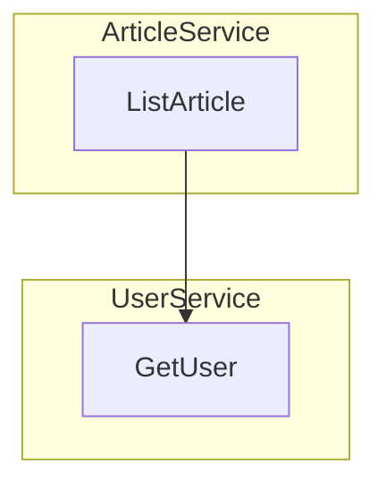

# modular-monolith-example-ts

[Go](https://github.com/aplulu/modular-monolith-example-go) | [TypeScript](https://github.com/aplulu/modular-monolith-example-ts)

TypeScript/NodeでのModular Monolith及びサービス間通信のサンプル実装です。

サービス間の通信はgRPC経由としていますが、ServiceServerとServiceClientをServiceAdapterが仲介することにより、ネットワーク接続がない状態でgRPCを使ったサービス間通信を実現しています。

ServiceAdapterの実装: `src/grpc/service_adapter.ts`

現時点では[Goでの実装](https://github.com/aplulu/modular-monolith-example-go)と比較して実装が不完全ですが、今後改善を予定しています。

## 前提環境

- Docker
- Docker Compose
- GNU Make

## ローカル環境の起動

```shell
$ make up
```

## ローカル環境の停止

```shell
$ make down
```

## gRPCのコード生成

```shell
$ make buf-generate
```

## 確認用のgRPCリクエスト

### gRPC

Reflection Serviceをサポートしていないため、protoファイルを指定してリクエストを送る必要があります。
See https://github.com/connectrpc/connect-es/issues/507

```shell
$ grpcurl -import-path api/proto -proto example/article/v1/article.proto  -plaintext localhost:8080 example.article.v1.ArticleService/ListArticle
```

### Connect
curlからリクエストを送る場合は `src/infrastructure/http/server.ts` のコメントを参考にしてHTTP/2を無効化してください。

```shell
$ curl -X POST -H "Content-Type: application/json" -d '{}' http://localhost:8080/example.article.v1.ArticleService/ListArticle
```

### Connect (GET)

```shell
$ curl 'http://localhost:8080/example.article.v1.ArticleService/ListArticle?encoding=json&message=\{\}'
```

## Architecture

このサンプルではモジュラモノリスアーキテクチャを採用しています。

以下の2つサービスで構成されています。

### ArticleService
ArticleServiceは、記事の管理と提供を行うサービスです。

公開API
* ListArticle: 自サービスが管理する記事のリストを返却します。

### UserService
UserServiceは、ユーザの管理と情報提供を行うサービスです。

内部API
* GetUser: ユーザIDを受け取り、対応するユーザ情報を返却します。



## 未実装や制約項目

* アプリケーション自体のエラーハンドリングが出来ていない
* gRPCのReflectionサービスがサポートされていない
  * grpcurlでリクエストを送るためにはprotoファイルを指定する必要があり面倒
  * Connect側で未サポート https://github.com/connectrpc/connect-es/issues/507
* gRPC (Connect互換ではない方)とConnectの両対応
  * 内部のサービス間通信にはConnectではなくgRPCを使いたい
* HTTP1とHTTP2の両対応
  * curl ( `--http2` つけてもだめ)とgrpcurlの両方でリクエストを送れるようにしたい

## ディレクトリ構成

```
.
├── api
│   └── proto
│       └── example // gRPCのプロトコル定義
├── docker // Docker関連ファイル
└── src
    ├── entrypoint.ts // エントリーポイント
    ├── component // モジュラモノリスの各サービス
    │   ├── article // 記事サービス
    │   │   ├── domain // ドメイン層
    │   │   │   ├── model // モデル
    │   │   │   └── repository // リポジトリインターフェース
    │   │   ├── infrastructure // インフラストラクチャ層
    │   │   │   └── inmemory // インメモリリポジトリ
    │   │   ├── interface // インターフェース層
    │   │   │   └── grpc // gRPCサーバー
    │   │   └── usecase // ユースケース層
    │   └── user // ユーザサービス
    ├── config // 設定
    ├── grpc
    │   └── example // 自動生成されたgRPCコード
    └── infrastructure
        └── http // HTTPサーバー

```
